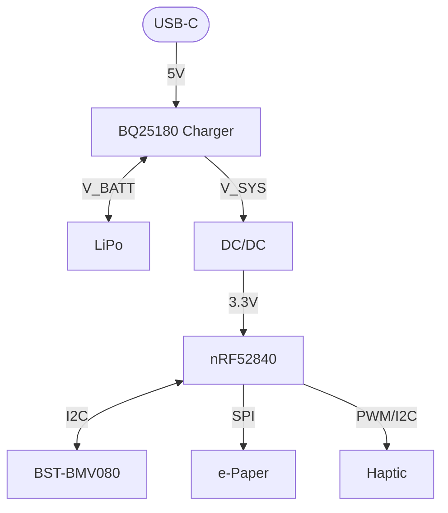

# ⌚ InkTime Smartwatch

**InkTime** este un concept de smartwatch open-source, creat pentru a fi ieftin, eficient energetic și ușor de asamblat. Acest repository conține documentația Hardware, Mecanică și de Fabricație pentru stadiul EVT.

---

## 🛠️ 1. Hardware

- **MCU:** NORDIC nRF52840 (BLE + control principal)
- **Display:** e-Paper (consum foarte redus, vizibil în soare)
- **Senzor:** BST-BMV080 (presiune barometrică)
- **Haptic:** motor vibrații controlat prin tranzistor
- **Alimentare:** baterie Li-Po LP502030

---

## 🗺️ 2. Diagrama Bloc

---

## 🔌 3. Pini

- **SPI (Display):** SCK, MOSI, MISO, CS  
- **I2C (Senzor):** SDA, SCL  
- **PWM (Haptic):** GPIO  
- **Butoane:** 3x GPIO (interrupt)

---

## 🏭 4. Manufacturing

Folder: `Manufacturing/`

- **Gerbers:** gerbers.zip  
- **Pick & Place:** .cpl  
- **BOM:** .bom  

Componente cheie:
- nRF52840 (QFN73)
- BST-BMV080
- Condensatoare 100nF (0201)
- Rezistențe pull-up (0201)

---

## 📦 5. Mecanică

Folder: `Mechanical/`

- Fusion 360 (.f3z)
- STEP (.step)

Include:
- Carcasă
- Baterie
- PCB
- Display
