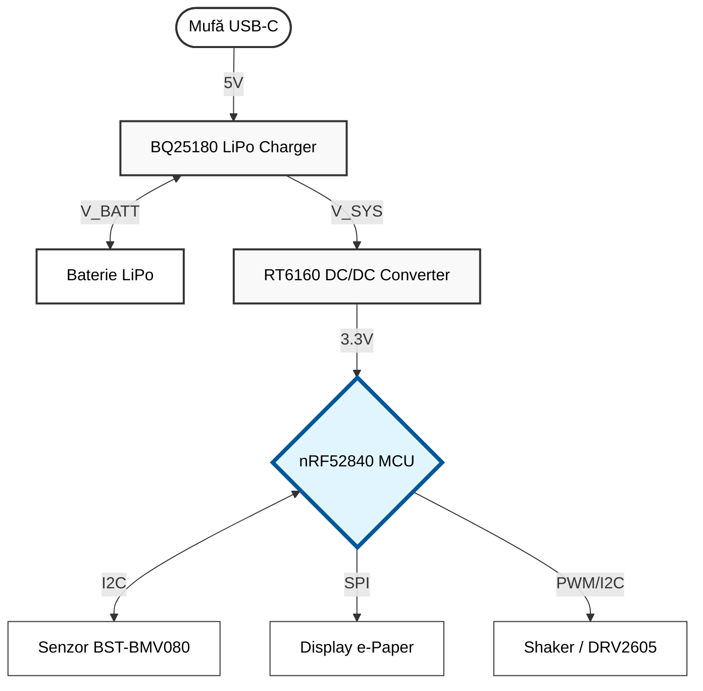

# ⌚ InkTime Smartwatch

**InkTime** este un concept de smartwatch open-source, creat cu scopul de a oferi un dispozitiv portabil ieftin, eficient din punct de vedere energetic și ușor de asamblat. Acest repository conține întreaga documentație Hardware, Mecanică și de Fabricație pentru stadiul EVT (Engineering Validation Test).

---

## 🛠️ 1. Descrierea Funcționalității Hardware

Sistemul este gândit pentru un consum redus de energie, fiind centrat în jurul unui SoC cu capabilități Bluetooth Low Energy.

* **Microcontroler (MCU):** Sistemul este condus de un **NORDIC nRF52840**, care gestionează atât logica principală, cât și comunicația wireless.
* **Afișaj:** Am integrat un display **e-Paper**, ideal pentru un smartwatch datorită vizibilității excelente în lumina soarelui și a consumului aproape de zero atunci când imaginea este statică.
* **Senzor:** Pentru funcțiile de monitorizare a mediului, am inclus senzorul barometric **BST-BMV080**, care oferă date precise despre presiune.
* **Feedback Haptic:** Un motor de vibrații (Shaker) este controlat printr-un tranzistor pentru a oferi notificări silențioase utilizatorului.
* **Alimentare:** Totul este susținut de o baterie **Li-Po LP502030** (32.5 x 21 x 5.5 mm), integrată perfect sub placa de bază.

---

## 🗺️ 2. Diagrama Bloc

Mai jos este prezentată arhitectura logică a smartwatch-ului și fluxul de alimentare/date, randată pentru lizibilitate maximă:

---

## 🔌 3. Configurația Pinilor (nRF52840)

Pentru a asigura o rutare eficientă și comunicarea corectă cu perifericele, au fost alocați următorii pini ai microcontrolerului:

| Componentă | Interfață / Rol | Pini NORDIC folosiți | Motivare |
|------------|----------------|----------------------|----------|
| Display e-Paper | SPI | SCK, MOSI, MISO, CS | Comunicație rapidă necesară pentru actualizarea ecranului |
| Senzor BST-BMV080 | I2C | SCL, SDA | Protocol standard și eficient |
| Shaker (Motor vibrații) | PWM (GPIO) | Pin Digital (ex: P0.xx) | Control intensitate vibrație |
| Butoane Utilizator | GPIO (Interupții) | 3x pini digitali | Navigare UI |

---

## 🏭 4. Fabricație (Manufacturing)

Toate fișierele necesare pentru producția în masă a PCBA-ului se regăsesc în folderul `Manufacturing/`.

- **Gerber Files:** `gerbers.zip` – gata pentru producție (ex: JLCPCB)
- **Pick and Place:** `.cpl`
- **Bill of Materials (BOM):** `.bom`

### Componente cheie:

| Componentă | Pachet | Sursă |
|------------|--------|-------|
| NORDIC nRF52840-QFAAA | QFN73 | Datasheet / JLC |
| BST-BMV080 | SMD | Datasheet / JLC |
| Condensatoare 100nF | 0201 | JLC Parts |
| Rezistențe Pull-up | 0201 | JLC Parts |

---

## 📦 5. Integrare Mecanică & 3D

Placa a fost rutată respectând constrângerile mecanice (poziția butoanelor și a mufei USB).

Fișiere disponibile în `Mechanical/`:

- `.f3z` (Fusion 360)
- `.step`

Include ansamblul complet:
- Carcasă
- Baterie
- PCB
- Display

Vedere explodată (Exploded View): stivuirea componentelor pentru integrare optimă.
