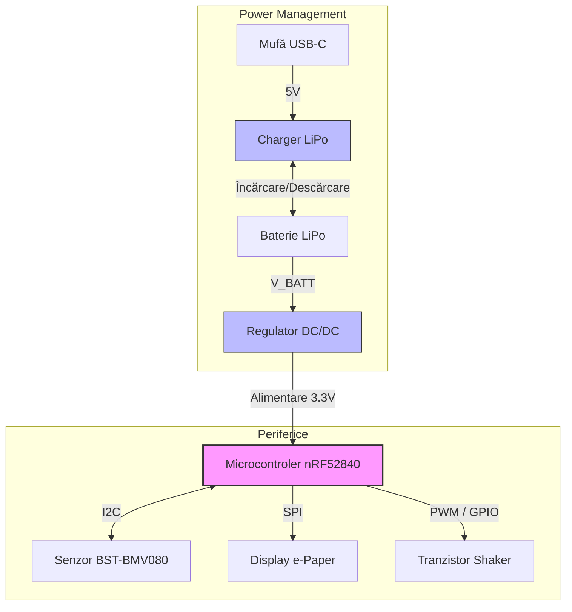

# ⌚ InkTime Smartwatch

**InkTime** este un concept de smartwatch open-source, creat cu scopul de a oferi un dispozitiv portabil ieftin, eficient din punct de vedere energetic și ușor de asamblat. Acest repository conține întreaga documentație Hardware, Mecanică și de Fabricație pentru stadiul EVT (Engineering Validation Test).

---

## 🛠️ 1. Descrierea Funcționalității Hardware

Sistemul este gândit pentru un consum redus de energie, fiind centrat în jurul unui SoC cu capabilități Bluetooth Low Energy.
* **Microcontroler (MCU):** Sistemul este condus de un **NORDIC nRF52840**, care gestionează atât logica principală, cât și comunicația wireless.
* **Afișaj:** Am integrat un display **e-Paper**, ideal pentru un smartwatch datorită vizibilității excelente în lumina soarelui și a consumului aproape de zero atunci când imaginea este statică.
* **Senzor:** Pentru funcțiile de monitorizare a mediului, am inclus senzorul barometric **BST-BMV080**, care oferă date precise despre presiune.
* **Feedback Haptic:** Un motor de vibrații (Shaker) este controlat printr-un tranzistor pentru a oferi notificări silențioase utilizatorului.
* **Alimentare:** Totul este susținut de o baterie **Li-Po LP502030** (32.5 x 21 x 5.5 mm), integrată perfect sub placa de bază, iar încărcarea și conversia sunt gestionate de circuite integrate dedicate (ex. BQ25180, RT6160).

---

## 🗺️ 2. Diagrama Bloc

Mai jos este prezentată arhitectura logică a smartwatch-ului și modul în care comunică modulele între ele:

---

## 🔌 3. Configurația Pinilor (nRF52840)

Pentru a asigura o rutare eficientă și comunicarea corectă cu perifericele, au fost alocați următorii pini ai microcontrolerului nRF52840:

| Componentă | Interfață / Rol | Pini NORDIC folosiți | Motivare |
| :--- | :--- | :--- | :--- |
| **Display e-Paper** | SPI | SCK, MOSI, MISO, CS | Comunicație rapidă necesară pentru actualizarea ecranului. |
| **Senzor BST-BMV080** | I2C | SCL, SDA | Protocol standard și eficient cu doar 2 fire pentru citirea datelor senzorilor. |
| **Shaker (Motor vibrații)** | PWM (GPIO) | Pin alocat PWM | Controlul turației/intensității vibrației printr-un semnal PWM generat din software. |
| **Butoane Utilizator** | GPIO (Interupții) | Pini Digitali x3 | Detectarea apăsărilor pentru navigarea în meniul ceasului prin întreruperi. |

---

## 🏭 4. Fabricație (Manufacturing)

Toate fișierele necesare pentru producția în masă a PCBA-ului se regăsesc în folderul `Manufacturing/`.

* **Gerber Files:** [gerbers.zip](./Manufacturing/gerbers.zip) - Gata pentru a fi trimise la un producător precum JLCPCB.
* **Pick and Place:** [Fișier .cpl](./Manufacturing/) - Coordonatele exacte pentru asamblarea automată SMD.
* **Bill of Materials (BOM):** [Fișier .bom](./Manufacturing/) - Lista completă a componentelor. Câteva piese cheie includ:

| Componentă | Pachet/Footprint | Sursă |
| :--- | :--- | :--- |
| NORDIC nRF52840-QFAA | AQFN73 | Datasheet / JLC |
| BST-BMV080 | SMD | Datasheet / JLC |
| Condensatoare Decuplare 100nF | 0201 | JLC Parts |
| Rezistențe Pull-up | 0201 | JLC Parts |

---

## 📦 5. Integrare Mecanică & 3D

Placa a fost rutată respectând constrângerile mecanice (poziția butoanelor și a mufei USB). Ansamblul 3D complet se află în folderul `Mechanical/` în formatele `.f3z` (Nativ Fusion 360) și `.step`.

**Vederea "Exploded" a asamblării:**

